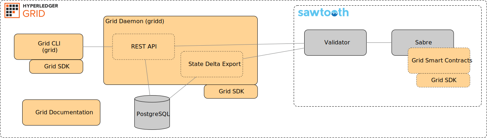
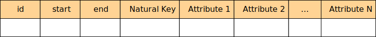
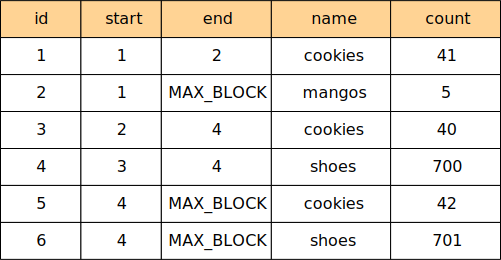
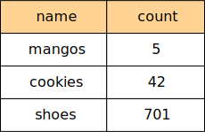
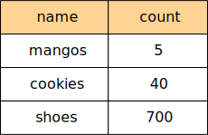

- Feature Name: components
- Start Date: 2019-05-06
- RFC PR: N/A
- Grid Issue: N/A

# Summary

Hyperledger Grid is a platform which contains various components which can be
assembled to implement supply chain solutions. This RFC proposes the initial
high-level structure of the project and the layout of the source code.

# Motivation

The distributed development of Hyperledger Grid makes communication between
contributors and potential contributors important. By explicitly agreeing upon
and explaining the early intended architectural components which make up Grid,
all contributors will have a base level of understanding to contextualize their
own work. In addition, this RFC can provide a baseline which other RFCs can
reference as the architecture is modified and enhanced moving forward.

# Guide-level explanation

Hyperledger Grid uses Hyperledger Sawtooth as a distributed
Byzantine-fault-tolerant database. Therefore, several of the architectural
components described here are probably familiar to Sawtooth application
developers. However, the architecture is intended to support use cases beyond
those which can be solved with a distributed Byzantine-fault-tolerant database.
For example, while much of the Grid daemon as described below is related to the
implementation of Sawtooth functionality (such as state delta export), we
anticipate the Grid Daemon will contain any Grid code which runs as a service.

Grid contains the following components:

- A daemon process called “gridd” (pronounced grid-dee) or Grid daemon
- A command line tool called “grid” or Grid CLI
- A Grid SDK
- Smart contracts
- Documentation



## Daemon (gridd)

Hyperledger Grid provides several services which are always running. The
services are of three types: 1) application-facing services; 2) integration
services; and 3) network-facing services. An example of a application-facing
service is the REST API which is the primary point of interaction between
applications and the Grid daemon. An example of an integration service is state
delta export, which integrates with a Sawtooth validator to materialize
Sawtooth’s global state into a PostgreSQL database that is used within the Grid
daemon. Network-facing services interact with other Grid daemons to form a Grid
network and are not directly covered here; however, if the Sawtooth validator
was 100% Rust code, conceptually it could be compiled into the Grid daemon and
be considered a network-facing service.

The Grid daemon process contains all of the components which run as
a persistent process as part of Hyperledger Grid. An intentional part of the
Grid architecture is to minimize persistent processes to a bare minimum with
the ideal state being a single Grid daemon process. This is architecturally
distinct from Hyperledger Sawtooth’s design which favors flexibility by
utilizing numerous processes which connect to each other. The impact of the
Grid architecture is that it will be simple to deploy a Grid daemon, but
suggests the project should use a single programming language (Rust) for all
persistent process code.

Initially, the Grid daemon contains:

- A REST API
- State Delta Export

Additional components will be added to the Grid daemon in the future.

### REST API

The Grid daemon’s REST API is the primary interface between applications and
Hyperledger Grid.

The Grid REST API provides an interface for applications to:

- Submit transactions
- Read/query schema data
- Read/query Pike identity data
- Read/query product data
- Read/query track and trace data

The REST API’s functionality will continue to expand to match the capabilities
provided by Hyperledger Grid. This includes additional APIs for data-related
read/query, Grid management and configuration (potentially including management
and configuration of the Grid daemon itself), application key “escrow”, and any
other functionality which is provided by Grid for applications.

### State Delta Export

The Grid state delta export component processes events from a Sawtooth instance
and stores it into a reporting database.  The initial implementation will
export to a PostgreSQL database instance which, in turn, provides the data for
the REST API.

The State Delta Export component will insert records into a database using
a modified Type 2 Slowly Changing Dimensions (SCD) record schema.  Each record
that has been exported from Sawtooth global state will include a "start" and
"end" for when the value of the record is effective.  Unlike traditional SCD,
the "start" and "end" values are block heights instead of timestamps.



For example, suppose we are tracking the count of some items in global state.
A materialized view of the data within PostgreSQL might look like:



We can query this table to obtain the latest data with the following:

```sql
SELECT FROM counts_table name,count WHERE end = MAX_BLOCK;
```



And we could query the state as of block 3 with the following:

```sql
SELECT FROM counts_table name,count WHERE start <= 3 AND 3 < end;
```



Using this model, records may be joined across tables at a given block height.
This provides consistent views for the data at any point in time.  For example,
if a block is committed while paging records, the resulting count of records at
the initial block height queried will remain the same.

## Command Line Tool (grid)

The Grid CLI (`grid`) provides an command-line interface for interacting with the
Grid Daemon’s REST API, with the Grid CLI mirroring the functionality available
in the REST API. For example, the Grid CLI will provide functionality to:

- Submit transactions
- Read/query schema data
- Read/query Pike identity data
- Read/query product data
- Read/query track and trace data

The CLI will also contain administrative commands, such as initializing
a PostgreSQL instance with the necessary tables for State Delta Export.

The Grid CLI should feel natural on a Linux system and adhere to Linux CLI
norms and should be suitable for use when scripting. For example, when an error
occurs, the CLI command should exit with a non-zero exit status so that it can
be checked in a bash script. The command’s output should be both human friendly
and easily parsable with common Linux command line tools such as awk and sed
(when necessary, as different command-line options). 

The Grid CLI will use the Rust clap library to parse command line arguments,
with restrictions. Problematic multiple-value syntax such as `-o <val1> <val2>`
should be avoided and `-o <val1> -o <val2>` form used instead.

## SDK

The Grid SDK provides programming support for application developers and
systems integrators. Initially, only the Rust programming language is
supported, though others may be proposed in future RFCs.

In particular, the SDK includes APIs and implementations to help write smart
contracts, including:

- Reading product information from state
- Reading Pike identity information from state
- Reading schema information from state
- Pike permission verifier
- Schema compliance verify

Like the other components, the SDK will grow over time as new features are
supported by Grid. When adding new features or making changes to the SDK,
backwards compatibility should be considered. The SDK’s versioning should
conform to semver (which is true of all components, but of particular
importance for the SDK).
Smart Contracts

Several features of Hyperledger Grid use smart contracts as part of their
implementation. The smart contracts are deployed in Sabre, which is part of
Hyperledger Sawtooth. Sabre executes smart contracts which have been compiled
to WebAssembly. Most of the smart contracts which are formally part of
Hyperledger Grid will be written in the Rust programming language. However,
future RFCs may extend this to additional programming languages supported by
future versions of Sabre.

Some initial smart contracts supported by Grid are:

- Grid Product
- Grid Pike
- Grid Track and Trace
- Grid Schemas

Smart contracts added to Grid will likely always be accompanied by an RFC which
documents the problem they solve and technical details needed to write and
maintain the smart contract.

## Documentation

Hyperledger Grid’s documentation plays a critical role in describing Grid to
potential users and providing necessary guide and reference material for
application developers, systems integrators, and systems administrators.

The team feels strongly that “documentation is source code” and the approach to
maintaining it matches the processes we use for all other development. As such,
we have chosen formats for documentation which are friendly to source control
under git while providing the best output possible. The documentation is
written in: a) Rust doc comments for SDK API documentation; b) sphinx-doc for
the bulk of non-API documentation; c) Markdown friendly for viewing directly in
github for specific other documents.

The sphinx-doc documentation will include an introduction to Grid, user guides,
developer guides, system administration guides, CLI reference, smart contract
specifications, and more.

As new additions to Grid are added the documentation should be updated as well.

# Reference-level explanation
The initial organization of the grid repository shall be:

`grid/bin/` - Convenience scripts for developers. This directory is never
packaged or installed.

`grid/cli/` - The Grid CLI command source code.

`grid/contracts/<contract>/` - Smart contract source code, with each smart
contract having a separate directory “<contract>”.

`grid/daemon/` - The Grid daemon source code.

`grid/docs/` - The sphinx-doc documentation source code.

`grid/sdk/` - The Grid SDK source code.

# Drawbacks

The Grid CLI may not be necessary for all users of Grid as many of its
functions could be done by programming against the REST API.

The Grid Daemon process will grow over time to include many components and
become quite large. However, the alternative would be many separate persistent
processes which would become difficult to manage.

The Grid SDK currently only covers Rust. The organization of the repo may need
to change if additional SDKs are added to the repository in the future.

# Rationale and alternatives

No alternatives were considered as much of the design contained herein is
derived from either existing components or decisions.

# Prior art

The state delta export and the Rest API are largely based on work that has been
done for several Sawtooth example applications such as Sawtooth Supply Chain.

# Unresolved questions

None at this time.
