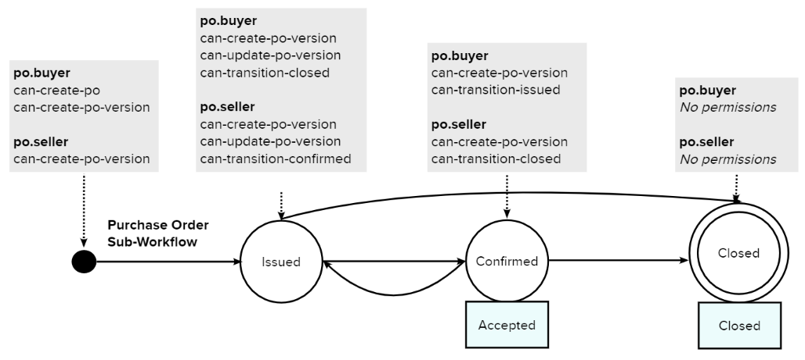
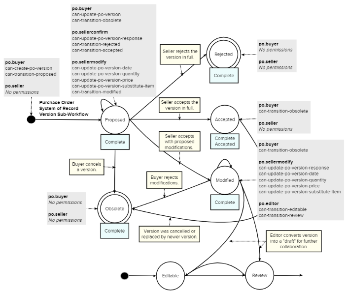
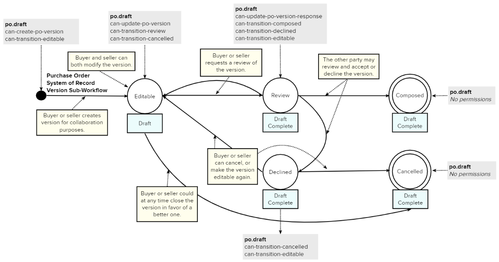
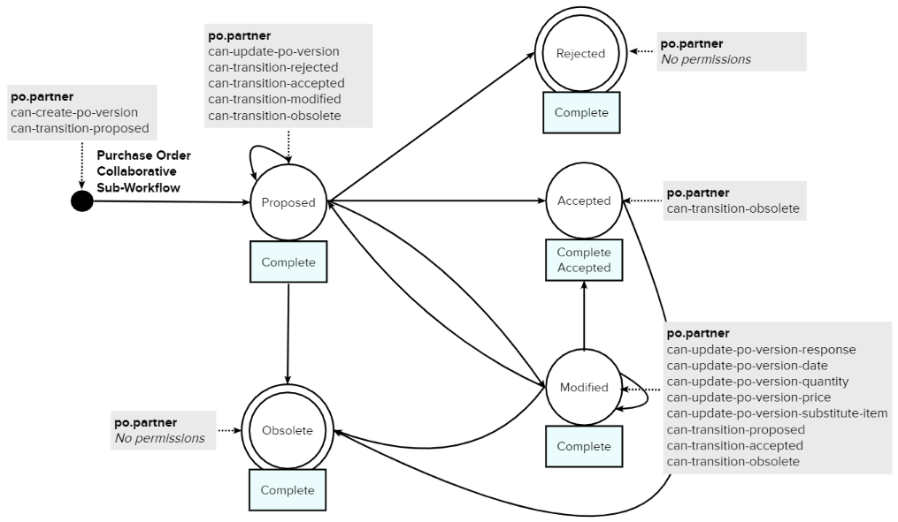
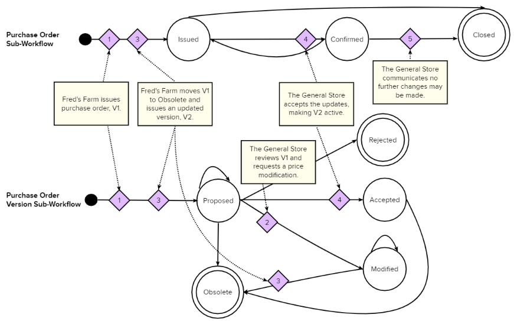
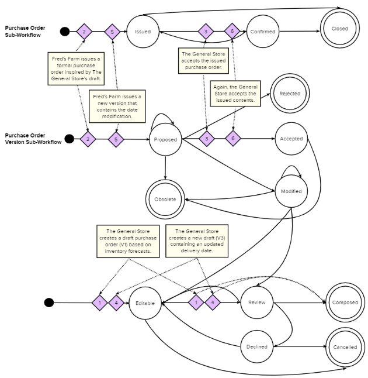

- Feature Name: Grid Purchase Order
- Start Date: 2020-02-25
- RFC PR: 25
- Hyperledger Grid Issue:

# Table of Contents

- [Summary](0025-purchase-order.md#summary)
- [Motivation](0025-purchase-order.md#motivation)
- [Guide-level Explanation](0025-purchase-order.md#guide-level-explanation)
- [Reference-level Explanation](0025-purchase-order.md#reference-level-explanation)
- [Drawbacks](0025-purchase-order.md#drawbacks)
- [Rationale and Alternatives](0025-purchase-order.md#rationale-and-alternatives)
- [Prior Art](0025-purchase-order.md#prior-art)
- [Unresolved Questions](0025-purchase-order.md#unresolved-questions)

# Summary
[summary]: #summary

Communicating Purchase Order details via email, EDI or other traditional methods
creates uncertainty for both buyers and sellers today because they lack a shared
view of the order’s status and contents. Siloed views of order data can lead to
misalignment and result in undesirable outcomes such as a customer dispute.
Hyperledger Grid Purchase Order aims to address this challenge by providing a
secure mechanism for trade partners to collaborate on the creation and
modification of a purchase order, all while enjoying a shared view into the
state of the order.

Trade partner communication is more secure and streamlined with Hyperledger Grid
Purchase Order through signed transactions, user permissions, and shared state
managed by consensus. Grid Purchase Order requires transactions are signed,
which is supported but not required by traditional communication methods.
The signing key is further validated against the organization's permissions
using Hyperledger Grid Pike, ensuring only authorized users are able to make
changes to the shared state. Once a Grid Purchase Order transaction is
validated, the shared state is updated and managed by consensus. This removes
the need for traditional back and forth messages to ensure communication has
been successful.

The design allows a buyer to order a specified quantity of goods and services
from a seller for a single shipment to a single location. The business use case
that inspired this design is that of a vendor-managed purchasing relationship.
However, the design was broadened to also support a more traditional procurement
relationship between a buyer and a seller. As a reviewer of this document, we
request that you comment on how this design does/does not support your
purchasing needs.

Grid Purchase Order leverages other Hyperledger Grid components including Grid
Pike, Grid Workflow, Grid Product, and Grid Location. In the near-term, this
business capability is focused on solving a need to better communicate and
collaborate on purchasing information. Looking to the future, it sets the stage
for further integration, both upstream and downstream, with order fulfillment
and settlement business processes.

# Motivation
[motivation]: #motivation

The Grid Purchase Order implementation is designed to share purchasing
information between trade partners. The purchase of goods and services is a
primary activity within the supply chain and the communication of order
information occurs in various ways today: by phone, email, SMS, eCommerce
marketplaces, Electronic Data Interchange (EDI), etc. Both the manual
coordination and automated, point-to-point sharing of purchasing information
between trade partners present challenges within day-to-day supply chain
operations. Pain points include: poor data accuracy stemming from manual data
entry errors, discrepancies between systems which impact receiving or result in
financial claims, costs related to administrative/clerical time, and management
of custom integrations.

The Grid Purchase Order concept aims to address these pain points by offering a
common industry solution for sharing purchase order information between trade
partners on Grid. Trade partners have the option to integrate this Grid
component with existing systems of record.

Expected outcomes include:

- Improved cost efficiency. An organization’s financial results can benefit
from a reduction in administrative time spent manually inputting data,
reconciling transactional differences with trade partners, performing
credit/debit adjustments, addressing receiving problems, and handling product
returns.

- Improved transaction accuracy. Automated sharing of purchasing data can reduce
errors that stem from manual data entry.

- Increased speed. Large volumes of data can be quickly communicated between
organizations, leading to faster response times, improved buying decisions and
production planning, greater customer satisfaction, and visibility into order
status.

- Improved productivity. Less time spent comparing documents and resolving
discrepancies means team members can focus on move value-add business
opportunities.

- Increased transparency of past transactions. Ability to view past
transactions allows historical data to be leveraged for current and future
business and marketing opportunities.

# Guide-level Explanation
[guide-level-explanation]: #guide-level-explanation

A purchase order is a business transaction that specifies the details of goods
or services a Buyer ordered from a Seller under agreed upon conditions. The
transaction contains information such as the trade items ordered (with
associated quantity and price), shipping details, payment terms, etc.

In the simplest business scenario, a purchase order is issued by a buyer,
confirmed in full by a seller, and fulfilled with no further collaboration
necessary. In more involved business scenarios – where product is out of stock,
or requested delivery dates must be adjusted – trade partners interact to reach
agreement and modify purchase order records. This RFC aims to offer a solution
to collaboration needs – both simple and complex -- by defining a default
Purchase Order design. The design leverages Grid Workflow, which requires the
use of a state transition model, to define the states through which a purchase
order may flow. The design also leverages Grid Pike to configure role-based
access control. The content that follows describes the default design.

## Actions

This design introduces four smart contract actions that, with the appropriate
permissions, a user of the system may perform. An action represents a change
to the shared state of a purchase order.

- Create PO. Allows for the creation of a new purchase order record.
- Update PO. Allows for the modification of an existing purchase order record.
- Create Version. Allows for the creation of a new version of a purchase order.
- Update Version. Allows for the modification of an existing purchase order
  version.

## Workflows

The design introduces three sub-workflows that each play a role in managing the
shared view of a purchase order. The Purchase Order Sub-Workflow manages the
business process states in which a purchase order record may exist. The System
of Record Version Sub-Workflow governs how actions taken on one or many versions
of a purchase order influence the shared state of the overall record. The
Collaborative Version Sub-Workflow also governs actions taken on versions, but
caters specifically to trade partners who use Grid as their purchase order
system of record.

These sub-workflows represent an out-of-the-box pattern for purchase order
collaboration. Alternative sub-workflows may be configured by trade partners
who need to support a different view of the business process. Partners could
configure different workflow states, constraints, and/or permissions to achieve
the goals of their business relationship.

Each sub-workflow is comprised of a series of states which define how a purchase
order evolves from start to finish. Some workflows progress in a linear fashion;
other workflows accommodate progression and regression based on the actions
taken by trade partners. Each workflow state contains a list of constraints –
think business rules – that must be met before a purchase order can enter that
state. In addition, each workflow state contains a list of permissions that
outline what actions may be taken, by whom, at that stage in a purchase order’s
life.

### Purchase Order Sub-Workflow



The Purchase Order Sub-Workflow defines the states through which a purchase
order record may progress. A purchase order record is like a container that can
hold multiple versions of the purchase order, both active and historical.
Defining a state at the record level provides context regarding the overall
progression of the purchase order. This summary state is informed by actions
taken on underlying versions of the purchase order.

The sub-workflow consists of the following states: _Issued_, _Confirmed_, and
_Closed_. Two business rules (also known as constraints) dictate when a purchase
order may proceed to the next state.

> Note: This text will use the notation "_contstraint::{xyz}_" to refer to a
> purchase order sub-workflow constraint.

- _constraint::Accepted_ - This constraint is met when the purchase order has an
  accepted version listed in its `accepted_version` field. Only one version of a
  purchase order may be accepted at a time.

- _constraint::Closed_ - If the purchase order record has been made final, then
 its `is_closed` field is set to `true` and further changes to its contents are
 prohibited.

#### States

**Beginning state:** A buyer is able to create a purchase order record alongside
a purchase order version. A seller is then able to create a
purchase order version. Versions enter the Purchase Order System of Record
Version Sub-Workflow at different points depending on permission assignments
(more on permissions later).

**Issued state:** When at least one version exists and no version
fulfills _constraint::Accepted_, then the purchase order record exists in
_Issued_ state. In this state, buyers and sellers are permitted to create
new versions and update existing versions in line with their respective workflow
permissions. A seller has special permission to transition a purchase order
into _Confirmed_ state by satisfying _constraint::Accepted_.

> Note: Some trade partners operate with a high level of trust and do not
> require confirmation of purchase order contents. In this scenario, a system
> agent could be created and granted permission to auto-transition a purchase
> order from _Issued_ state to _Confirmed_ state, altogether bypassing the Version
> Sub-Workflows introduced below.

**Confirmed state:** A purchase order transitions to the _Confirmed_ state when
both the buyer and seller have fully accepted its contents. It is assumed a
separate, but related, sales order fulfillment process is underway. During this
state, both a buyer and seller are permitted to request changes to the purchase
order by issuing a new version. A seller is also permitted to finalize a
purchase order by transitioning it into _Closed_ state. Note: If an _Accepted_
version is cancelled, then the record returns to Issued state.

**Closed state:** A purchase order in this state is final; it can no longer be
changed. To transition to this state, the _constraint::Closed_ must be met. Once
in _Closed_ state, no permissions are available to any party.

In practice, organizations apply different business logic to determine when a
purchase order is closed. Some orgs may accept changes up until one hour before
product ships, others may prohibit changes after a 48 hour lead time has
elapsed, etc. To maintain flexibility, orgs may use the Grid Integration
Component to manage the rules that control this constraint.

> Note: The Purchase Order Sub-Workflow assumes that business process states
> regarding the shipment and/or billing of an order belong to the sales order
> entity, not the purchase order entity.

### Purchase Order System of Record Version Sub-Workflow



The Purchase Order System of Record Version Sub-Workflow defines how trade
partners may collaborate on versions of a purchase order. Actions taken within
this version sub-workflow inform valid transitions between business process
states. More specifically, acceptance of a purchase order in this version
workflow enables the transition of a purchase order record from _Issued_ state
to _Confirmed_ state within the Purchase Order Sub-Workflow described above.

This workflow is designed with external systems in mind. Given the system of
record is a buyer’s ERP system, when a seller introduces modifications to a
record, then changes are treated as guidance until the buyer issues an updated
version. This rule is enforced via permissions at the two starting positions
within the sub-workflow. A buyer is permitted to propose a purchase order
version; a buyer or seller is permitted to initiate a draft for collaboration.

Two constraints dictate if a version can move from one state to another:

- _constraint::Complete_ - This constraint is met when a version's `is_draft`
  field is set to `false`.

- _constraint::Accepted(version)_ - This constraint is met when a version's
  state is set to _Accepted_. Only one version
  may be accepted at a time.

#### States

**Beginning state:** A buyer has permission to create a purchase
order version in this pre-proposed state.

**Proposed state:** A buyer can submit a version for review and approval by the
seller. A buyer has permission to update the proposal before the seller takes
action or can cancel the version in favor of a different one. A seller may
reject, accept or modify the version to the degree their granular update
permissions allow.

> Note: A seller may rely on ERP business logic to determine the
> appropriate transition from _Proposed_ state. This logic, such as checking
> contractual agreements or inventory availability, lives outside of the scope
> of Grid at this time.

**Rejected state:** A seller can reject a version in full. Neither the buyer nor
seller can take further action on the version. In the case where a seller
rejected with a reason and the buyer wants to alter the order based on the
seller’s feedback, the buyer may issue a new version.

**Accepted state:** A seller has reviewed and accepted the version in full. A
separate sales order entity (out of scope of Grid Purchase Order) may be created
within the seller’s system. The version is listed in the purchase order's
`accepted_version` field, prelacing a previously accepted purchase order if
applicable. A buyer is permitted to cancel an accepted purchase order so long as
the seller has not moved the purchase order to a _Closed_ state. A seller may
take no further action on the version.

**Obsolete state:** A version was cancelled by the buyer for any of a variety
of reasons. The buyer and seller can take no further action on the version.

**Modified state:** A version is partially confirmed (often referred to as
‘accepted with changes’) and awaiting further approval. At this time, a seller
generally creates a related sales order in their system of record. A buyer may
move the version to _Obsolete_ and issue a new version based on the seller’s
guidance. A seller may update the suggested modifications so long as the buyer
has yet to take action. An editor may convert the version into a draft for
further collaboration.

The second half of the System of Record Version Sub-Workflow provides trade
partners a shared editing capability with which a version can be co-created. The
flow represents an “offer” process of sorts and benefits sellers who, as part of
their business relationship, suggest purchase order details to a buyer to
inspire the issuance of a purchase order from the buyer. An additional
constraint controls the movement of a version from one state to another.

- _constraint::Draft_ - This constraint is met when the `is_draft` field for
  the version is set to `true`.



#### Draft States

**Beginning state:** An organization with po::draft permissions created a
version for collaboration purposes.

**Editable state:** The contents of the version are being populated by one or
more organizations. Any organization with po::draft permissions can submit the
draft for review or close it in favor of a different version.

**Review state:** An organization has proposed the version for review by another
organization. Another organization has permission to approve the version by
moving it to _Composed_ state. The organization may also decline the version,
with the option to add a rejection reason, or move it back to _Editable_ state
for further modification.

**Composed state:** Both organizations have accepted the contents of the
version. The buying organization may decide to issue a formal purchase order
based on the drafted contents.

**Declined state:** An organization has declined the version content. Any
organization may move it back to _Editable_ state for further modification or
choose to cancel the version.

**Cancelled state:** A version is no longer relevant; it is no longer editable.

### Purchase Order Collaborative Sub-Workflow



The Collaborative Sub-Workflow enables trade partners a means to manage
purchase order records exclusively on Grid. Without the need to maintain data
integrity with external systems of record, more actions are available to trade
partners.

> Note: This workflow illustrates a potential long-term vision for this
> business capability on Grid. A detailed explanation has been omitted for
> brevity.

## Workflow State Permissions

As seen in the above diagrams, this RFC defines a set of permissions at each
state in a sub-workflow. Permissions are assigned to an alias, such as
po::buyer, and dictate what actions a user with said permissions may take at
that stage of a purchase order’s  or version's life. An organization may craft
roles within Grid Pike by assigning one or more aliases to a user. Additional
aliases may be introduced in the future.

## Field Restrictions

When creating a purchase order version, mandatory data elements must have a
value defined. Similarly, when updating a purchase order, a subset of fields
cannot be edited. These requirements are hard-coded and enforced by smart
contract logic. Should a source system dictate additional data elements that
must remain unchanged, validation may be introduced through the integration
component.

## Transactions

Purchase Orders are managed by submitting transactions to Hyperledger Grid,
which will process them via the Grid Purchase Order smart contract. The
following transactions are supported:

- `po create`: Create a purchase order record and store it in ledger state.
- `po update`: Update the properties of a purchase order already in ledger
  state.
- `po version create`: Create a version of a purchase order and store it in
  ledger state.
- `po version update` Update the properties of a purchase order version already
  in ledger state.

## Examples

### General Business Scenario
In this example, two organizations are participating on a network: Fred’s Farm
and The General Store. Fred’s Farm represents a buyer who purchases animal
feed and other on-farm equipment from a seller, The General Store. The
organizations choose to define roles as follows.

```
Name: FredsFarm.Admin
Permissions:
    - po::buyer
    - allowed _organizations: [ ]
    - inherit_from: [ ]

Name: TheGeneralStore.Admin
Permissions:
    - po::sellerconfirm
    - po::sellermodify
Allowed _organizations: [ ]
Inherit_from: [ ]
```

On June 1, 2018, Fred’s Farm issues a purchase order (PO8865) to The General
Store. The order contains two products:
- 50 tons of bulk dairy feed to be dropped off at Bin 2 on the farm.
- 25 bags of specialty feed.

Pricing is included for each line item. Fred’s Farm requests a delivery date of
June 4, provides instructions to the driver for how to access the farm gate,
and expects to receive an order confirmation from The General Store.

The General Store reviews the purchase order and sees Fred’s Farm used a
historical price for the specialty feed. The General Store requests modification
to the purchase order, citing a need to update the price for the second line
item from $10 per bag to $12 per bag.

Fred’s Farm reviews the suggested modifications and agrees with the updated
price. The buyer closes the initial version and issues a new version containing
the price modifications. The General Store accepts the new version and
fulfillment begins. Two days later, after their 48-hour lead time rule expired,
The General Store communicates the purchase order is final and no further
changes may be accepted.



### Vendor-Managed Purchasing Scenario

In this example, The General Store manages the supply of animal feed on behalf
of Fred’s Farm and suggests purchase orders to Fred’s Farm based on demand
forecasts. Fred’s Farm has granted The General Store the ability to draft
purchase orders without the need for Fred’s Farm to review the contents (a
system agent auto-accepts the purchase order in the Review state). Formally
issued purchase orders will then be issued by Fred’s Farm system of record,
based on composed contents.

On August 1, 2018, The General Store submits a draft purchase order to Fred’s
Farm based on projected inventory needs. The proposal calls for 35 bags of
horse feed to be delivered to the farm on August 5. Per their business
agreement, Fred’s Farm uses the draft contents to issue a formal purchase order
from the system of record. The next day, The General Store submits a new draft
that contains a modified delivery date (inventory forecasts changed based on
on-farm feed consumption). Fred’s Farm again loads the updates into their system
of record and issues an updated purchase order.



# Reference-level explanation
[reference-level-explanation]: #reference-level-explanation

## State

### PurchaseOrder

Purchase order state is composed of several objects with the primary object
being the `PurchaseOrder`. The fields `buyer_org_id` and `seller_org_id` are
the organizations engaging in the purchase order's transaction; these fields
are the organizations' Grid Pike ID. A purchase order identifies organization's
by their `GLN`, Global Location Number. The `GLN` and Grid Pike organization
IDs included in the `PurchaseOrder` should refer to the same organizations.
`PurchaseOrder` contains the following fields

- `uid` - Unique identifier for Purchase Order
- `workflow_state` - Workflow state the purchase order is currently in. Values
are defined by the smart contract workflows
- `buyer_org_id` - Grid Pike organization ID associated with the buying
organization defined by the XML in the purchase order's `order_xml_v3_4` field.
- `seller_org_id` - Grid Pike organization ID associated with the selling
organization defined by the XML in the purchase order's `order_xml_v3_4` field.
- `is_closed` - True if purchase order was closed, false otherwise
- `accepted_version_number` - The ID of the purchase order that has been
accepted
- `versions` - A list of different purchase order versions
- `created_at` - When the document was created in seconds since January 1, 1970
- `workflow_type` - Indicates the workflow the purchase order belongs to

```protobuf
message PurchaseOrder {
  required string uid = 1;
  required string workflow_state = 2;
  string buyer_org_id = 3;
  string seller_org_id = 4;
  repeated PurchaseOrderVersion versions = 5;
  string accepted_version_number = 6;
  repeated PurchaseOrderAlternateId alternate_ids = 7;
  uint64 created_at = 8;
  bool is_closed = 9;
  string workflow_type = 10;
}
```

### PurchaseOrderVersion

`PurchaseOrderVersion` represents a new version of a purchase order.
`PurchaseOrderVersion`s move through the version workflow if `is_draft` is
false, or through the draft workflow if `is_draft` is true. The current state
the version is in is indicated by the `workflow_state` field. A
`PurchaseOrderVersion` is identified by its `version_id` and owning purchase
order, which is globally unique. `revisions` is a list of revisions to version,
and `current_revision_number` is the identifier of the most recent revision.

```protobuf
message PurchaseOrderVersion {
  string version_id = 1;
  string workflow_state = 2;
  bool is_draft = 3;
  string current_revision_id = 4;
  repeated PurchaseOrderRevision revisions = 5;
}
```

### PurchaseOrderRevision

`PurchaseOrderRevision` holds the editable fields of a purchase order, the time
the revision was created, and the public key of the submitter.

```protobuf
message PurchaseOrderRevision {
  string revision_id = 1;
  string submitter = 2;
  uint64 created_at = 3;

  string order_xml_v3_4 = 4;
}
```

### PurchaseOrderAlternateId

`PurchaseOrderAlternateId ` are the mechanism the smart contract will use to
allow purchase orders to be created and edited without having to specify a
purchase order number at creation. This is identical to the mechanism outlined
in the [Pike 2 RFC](https://github.com/hyperledger/grid-rfcs/pull/23).

The `id_type` is used to specify the field that will be used as an
alternate ID, and the `id` is an identifier for the purchase order.

```protobuf
message PurchaseOrderAlternateId {
  string id_type = 1;
  string id = 2;
  string po_uid = 3;
}
```

### Location Addressing in the Merkle-Radix State System

In order to uniquely locate Purchase Orders in the Merkle-Radix state system,
an address must be constructed which identifies the storage location of the
Purchase Order representation.

All Grid addresses are prefixed by the 6-hex-character namespace prefix
“621dee”. `PurchaseOrder` and `AlternativeID` are further prefixed under the
Grid namespace with reserved enumeration of `06`.

The remaining 62 characters of a `PurchaseOrder` address is calculated by taking
the first 60 characters of a SHA512 hash of its `uid` and concatenating it with
the prefix `00`.

```
“621dee” + “06” + “00” Sha512(uid)[:60]
```

The remaining 62 characters of a `AlternateID` address is calculated by taking
the first 60 characters of a SHA512 hash of the `org_id` concatinated with the
`alternate_id` and `id_type` and concatenating that hash with the prefix `01`.

```
“621dee” + “06” + “01” + Sha512(org_id + alternate_id + id_type)[:60]
```

## Transaction Payload and Execution

### PurchaseOrderPayload Transaction

`PurchaseOrderPayload` contains an action `enum` and the associated action
payload. This allows for the action payload to be dispatched to the appropriate
logic. Only the defined actions are available and only one action payload should
be defined in the `PurchaseOrderPayload`. `PurchaseOrderPayload` contains the
following required fields:
- `action` - Action enum, indicating the payload type
- `timestamp` - Time the payload was created

```protobuf
message PurchaseOrderPayload {
  enum Action {
    UNSET_ACTION = 0;
    CREATE_PO = 1;
    CREATE_VERSION = 2;
    UPDATE_VERSION = 3;
  }
  Action action = 1;
  uint64 timestamp = 2;

  CreatePurchaseOrderPayload create_po_payload = 3;
  UpdatePurchaseOrderPayload update_po_payload = 4;
  CreateVersionPayload create_version_payload = 5;
  UpdateVersionPayload update_version_payload = 6;
}

message CreatePurchaseOrderPayload {
  string uid = 1;
  uint64 created_at = 2;
  string buyer_org_id = 3;
  string seller_org_id = 4;
  string workflow_state = 5;
  repeated PurchaseOrderAlternateId alternate_ids = 6;
  CreateVersionPayload create_version_payload = 7;
}

message UpdatePurchaseOrderPayload {
  string po_uid = 1;
  string workflow_state = 2;
  bool is_closed = 3;
  string accepted_version_number = 4;
  repeated PurchaseOrderAlternateId alternate_ids = 5;
}

message CreateVersionPayload {
  string version_id = 1;
  string po_uid = 2;
  bool is_draft = 3;
  string workflow_state = 4;
  PayloadRevision revision = 5;
}

message UpdateVersionPayload {
  string version_id = 1;
  string po_uid = 2;
  string workflow_state = 3;
  bool is_draft = 4;
  PayloadRevision revision = 5;
}

message PayloadRevision {
  string revision_id = 1;
  string submitter = 2;
  uint64 created_at = 3;

  string order_xml_v3_4 = 4;
}
```

### Create Purchase Order Payload

`CreatePurchaseOrderPayload` add a new purchase order to state. An optional
`PurchaseOrderVersion` can be included in the payload representing the initial
version of the purchase order.

Validation Requirements:
- The signer must be a Pike agent
- The signing agent must have a Pike role with the `can-create-po` permission
- The `uid` must not refer to an existing purchase order
- The `buyer_org_id` must exist in Pike for it be a valid transaction
- The `seller_org_id` must exist in Pike for it be a valid transaction
- The `create_version_payload`, if included, must be valid according to the
`CreateVersionPayload` validation rules

Inputs:

Address of Pike `621dee05`
Address of Grid Purchase Order `621dee06`

Outputs:

Address of Grid Purchase Order `621dee06`

### Update Purchase Order Payload

`UpdatePurchaseOrderPayload` updates a purchase order's closed state,
`workflow_state`, or `accepted_version_number`.

Validation Requirements:
- The signer must be a Pike agent
- The signing agent must have a Pike role with the `can-update-po` permission
- The `po_uid` must refer to an existing purchase order

Inputs:

Address of Pike `621dee05`
Address of Grid Purchase Order `621dee06`

Outputs:

Address of Grid Purchase Order `621dee06`

### Create Version Payload

`CreateVersionPayload` creates a new `PurchaseOrderVersion`.

Validation Requirements
- The signer must be a Pike agent
- The signing agent must have a Pike role with the `can-create-po-version`
permission
- The `po_uid` must refer to an existing purchase order

Inputs:

Address of Pike `621dee05`
Address of Grid Purchase Order `621dee06`

Outputs:

Address of Grid Purchase Order `621dee06`

### Update Version Payload

`UpdateVersionPayload` updates an existing `PurchaseOrderVersion`
with a new revision.

Validation Requirements:
- The signer must be a Pike agent
- The signing agent must have a Pike role with the `can-update-po-version`
permission
- The `po_uid` must refer to an existing purchase order

Inputs:

Address of Pike `621dee05`
Address of Grid Purchase Order `621dee06`

Outputs:

Address of Grid Purchase Order `621dee06`

# Drawbacks
[drawbacks]: #drawbacks

- Grid Purchase Order forms an opinion on default Purchase Order workflow.
We researched industry standards in an effort to uncover a standard business
process for managing purchase order transactions across trade partners. We did
not uncover a standard workflow so we designed one in its absence (keeping a
design principle of flexibility in mind). The design aims to be generic where
possible to accommodate the integration of business-specific logic.

- Grid Purchase Order hardcodes data elements rather than utilizing Grid Schema.
This design assumes purchase order data elements are well known and can be
available for trade partners to use/not use as they wish. By hardcoding the list
of data elements, we know what fields are available and can drive business logic
from them (use of Schema makes this more difficult). However, if it is important
for trade partners to restrict the use of some of these well-known fields, then
additional mapping complexity may be introduced. Note: It is easier to
transition from a hardcode approach to use of Grid Schema than vice-versa.

- Grid Purchase Order defines a single data model. This design aims to
semantically represent core data elements found across various specifications
by using GS1’s Order and Order Response Business Message Standards (XML 3.4).
The XML standards recognize lower adoption today than other legacy EDI message
standards used in North America (ANSI) and internationally (EANCOM, EDIFACT).
However, the standards offer a unified view of data that bridges geographies.
Note: Data mapping and translation becomes a concern of the integration
component.

# Rationale and Alternatives
[alternatives]: #alternatives

Why is this design the best in the space of possible designs?

- Trade partners may collaborate on a shared version of the truth. This design
aims to modernize legacy EDI communication methods by allowing organizations to
more effectively partner on the creation and modification of purchase orders. It
offers a path to co-create versions and present a shared view of the status of a
purchase order.

- Organizations have flexibility in assigning permissions and roles. Through the
use of Grid Pike, trade partners may configure and assign permissions within
the Purchase Order workflows to reflect the distribution of roles within their
business partnership. An organization can delegate a role to another
organization, split permissions across multiple internal roles, etc.

- The data model is extensible. This RFC is focused on capturing the data
elements that are essential to constructing a complete purchase order
transaction. This initial set of data fields may be enhanced by future RFCs to
include additional data structures such allowance charges, related documents,
subline item information, delivery schedules, etc.

What other designs have been considered and what is the rationale for not
choosing them?

- Request for Quotation and Quote. When exploring how to provide a vendor with
the ability to propose purchase orders to a buyer, we considered Quote-related
business processes as a potential pathway to achieve our goal. We found this
introduced transactional capabilities that exceed the scope of the business
scenario in focus. These processes could live within Grid in the future as a
predecessor to Grid Purchase Order.

- Replenishment Request and Proposal. We also considered Replenishment-related
business processes when exploring how to provide a vendor with the ability to
propose purchase order details to a buyer. This standard contains too many gaps
when compared against our goal. Core purchasing data elements are omitted and
unnecessary transactions were introduced.

- Design that accommodates multiple shipments. We found a variety of industry
standards noted a best practice to avoid the creation of purchase orders that
contain multiple shipments. Per one GS1 standard, “incorporating multiple
ship-to locations creates potential processing problems for the receiver, ASN
problems for the buyer, billing issues for the supplier, and payable issues for
the buyer.” This RFC encourages adherence to this best practice. A future RFC
could outline support for this business scenario as a design enhancement.

- Validate participating organizations using Grid Location. A purchase
order, per GS1's standards, identifies organizations using a GLN, global
location number. The GLN attribute is used to define a companies' location. Grid
Location could be used to identify the purchase order's participating
organizations using the GLN attribute. Currently, Grid Purchase Order defines
the organizations using the `buyer_org_id` and `seller_org_id` fields,
corresponding to a Grid Pike organization ID. Using Grid Location and Grid
Pike, the purchase order's fields may be further validated to ensure the order
refers to valid organizations. At the expense of this, Grid Purchase Order is
initially designed with lightweight dependencies to allow flexibility. The
extended validation using Grid Location may be added to Grid Purchase Order as
an optional feature in the future.

What is the impact of not doing this?

- Data will continue to be controlled independently. This distributed design
offers a paradigm shift where the master record is represented on Grid for
shared visibility. Establishing a shared source of truth will help improve
order-to-invoice matching and reduce claims/disputes related to misaligned data.

- Continued inefficiencies stemming from manual tasks. Collaboration across
trade partners on the proposal and modification of purchase orders often occurs
offline by way of phone calls, emails, etc. This design offers a mechanism to
collaborate in a more systematic way.

# Prior Art
[prior-art]: #prior-art

- [Grid Product RFC](https://github.com/hyperledger/grid-rfcs/blob/master/text/0005-product.md)
- [Grid Location RFC](https://github.com/hyperledger/grid-rfcs/blob/master/text/0020-location.md)
- [Grid Pike RFC](https://github.com/hyperledger/grid-rfcs/pull/23)
- [Grid Workflow RFC](https://github.com/hyperledger/grid-rfcs/pull/24)

# Unresolved Questions
[unresolved]: #unresolved-questions

## State Transition Model

- Do the default Purchase Order states as described in this RFC resonate with
the community and play nicely with existing business processes?

- Both parties have equal permissions when collaborating on a draft purchase
order. How will we enforce segregation of duties (e.g. when one party
transitions the order into Review state then only the other party may take
action).

## Data Model & Permissions

- Must we define smart contract permissions separately from workflow state
permissions?

- Trade partners need the ability to define which data elements may be used
within a purchase order transaction to ensure compatibility with external
application constraints. Where should we control field definition: within Grid
or outside of Grid?

- Is it important to define a Data Type for data elements (e.g. numeric, text,
structure)?

- This design omits some data elements that appear specific to the transmission
of an EDI message such as DocumentStatusCode, ContentOwner, Sender,
HeaderVersion, etc. Do these fields need to be represented within Grid?

- Are there other data elements we should include in this initial design
(e.g. allowance charges)?

- Should we provide a supplemental artifact to the Community that explains
which data elements each granular permission controls?

## Data storage in state

- Do we want to store purchase orders as XML files or consume XML files as
part of the smart contract payloads?
